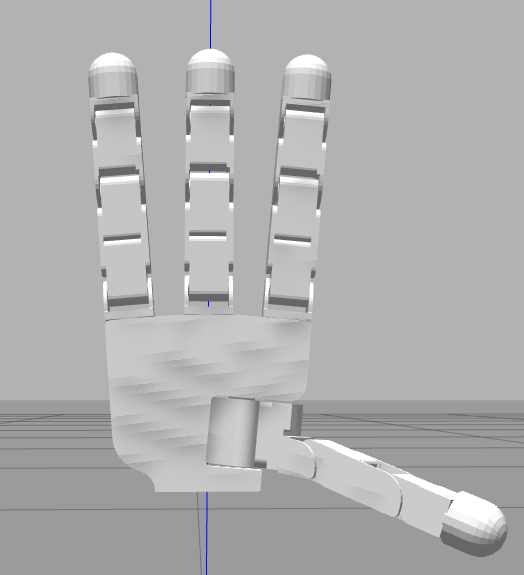

# SABRE robotic hand simulation

SABRE is a ROS 2 Jazzy and Gazebo Harmonic simulation of a realistic,
16-joint robotic hand. It uses the open-source Allegro Hand CAD geometry from
[PAL Robotics](https://github.com/pal-robotics/allegro_hand), integrated with
`gz_ros2_control` and reusable C++ command code.



The simulator and a future physical hand use the same ROS interface:

```text
/hand/target_joint_states -> hand_commander -> /hand_controller/joint_trajectory
```

## Mac users: read this first

The complete stack does **not** run reliably as a native macOS application.
ROS 2 Jazzy only provides Tier 3 source support for Intel macOS, while this
project also needs `ros2_control` and `gz_ros2_control`. On an Apple Silicon
Mac, use an **Ubuntu 24.04 ARM64 virtual machine**.

Recommended VM configuration:

- Ubuntu Desktop 24.04 ARM64
- 4 CPU cores minimum
- 8 GB RAM minimum (12 GB is better if the Mac has enough memory)
- 40 GB disk
- 3D acceleration enabled when the VM application offers it

UTM is the free option. Parallels generally provides smoother 3D graphics but
is paid. Do not run the commands below in the normal macOS Terminal; run them
in the Ubuntu VM terminal.

## Install and run

Inside Ubuntu 24.04:

```bash
git clone https://github.com/Tarangatang/Sabre.git
cd Sabre
./scripts/install_ubuntu.sh
./scripts/build.sh
./scripts/run_demo.sh
```

The last command opens Gazebo and automatically cycles through open, relaxed,
fist, pinch, and pointing poses. There is no second terminal required for the
demo.

The dependency installer is intentionally limited to Ubuntu 24.04. It exits
with a clear message on macOS or an unsupported Linux version instead of
partially installing an incompatible stack.

## Manual control

Start the simulator without the automatic pose cycle:

```bash
source /opt/ros/jazzy/setup.bash
source install/setup.bash
ros2 launch sabre_hand_bringup simulation.launch.py demo:=false
```

In a second Ubuntu terminal:

```bash
cd Sabre
source /opt/ros/jazzy/setup.bash
source install/setup.bash
ros2 run sabre_hand_control hand_commander --ros-args -p preset:=fist
ros2 run sabre_hand_control hand_commander --ros-args -p preset:=open
ros2 run sabre_hand_control hand_commander --ros-args -p preset:=pinch
ros2 run sabre_hand_control hand_commander --ros-args -p preset:=point
```

Each preset command publishes once and exits. To command selected joints from
your own code, publish a `sensor_msgs/msg/JointState` to
`/hand/target_joint_states`. The C++ commander retains unmentioned targets,
rejects unknown joints, and clamps commands to the model's physical limits.

## Diagnose an installation

```bash
./scripts/doctor.sh
```

It checks the operating system and confirms that ROS 2, Colcon, Gazebo, Xacro,
and the Jazzy installation are available.

## Physical-hand reuse

The C++ pose and validation code is independent of Gazebo. A real hand needs a
`ros2_control` hardware plugin that exposes the same 16 position-command
joints. Once that adapter exists, the behaviour nodes and command topic do not
change. If your physical hand is not an Allegro-compatible design, its exact
joint names, limits, and transmission ratios must be substituted before using
this code on hardware.

## Project layout

```text
scripts/                       Ubuntu install, build, run, and diagnostic tools
src/sabre_hand_description/    Allegro meshes, Xacro model, world, RViz config
src/sabre_hand_control/        Reusable C++ pose and command library
src/sabre_hand_bringup/        Jazzy/Harmonic launch and controller config
third_party/allegro_hand/      Upstream attribution and Apache-2.0 licence
tools/smoke_check.py           Dependency-free repository consistency checks
```

## Third-party model

The Allegro Hand visual meshes and adapted URDF geometry are copyright 2024
PAL Robotics S.L. and distributed under Apache License 2.0. See
`third_party/allegro_hand/NOTICE` and `third_party/allegro_hand/LICENSE`.
